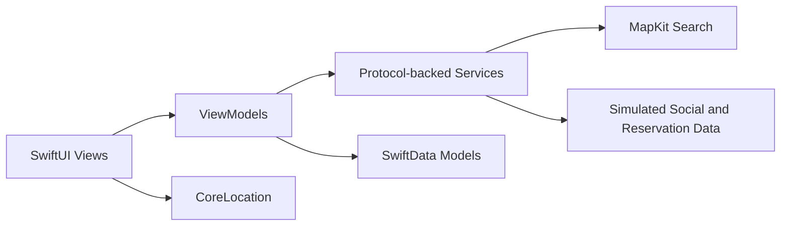

# Nibbl

Nibbl is an iOS restaurant discovery and group-planning prototype for finding, saving, comparing, and choosing places to eat.

## Overview

Nibbl helps users search nearby restaurants, save favorites, organize places into custom lists, and plan individual or group dining decisions. The app combines location-aware restaurant search with persistent restaurant tracking, swipe-based recommendations, and local reservation records so users can move from discovery to a shortlist to a selected spot.

## Features

- Location-aware restaurant search powered by MapKit
- Cuisine, price, distance, and rating filters
- Persistent saved and visited restaurant states using SwiftData
- Custom restaurant lists
- Individual and group planning flows
- Swipe-based restaurant recommendations
- Weighted match scoring with deterministic ranking
- Human-readable recommendation explanations
- Local reservation draft and confirmation tracking
- Simulated social profiles, social feed data, and reservation-provider behavior

## Screenshots Or Demo

No screenshots or demo assets are currently included in this repository.

## Architecture

The app follows a SwiftUI and MVVM-oriented structure:

- `Models`: SwiftData-backed restaurant, list, planning, reservation, and feed models
- `Services`: protocol-backed restaurant search, recommendation, reservation, feed, user, and haptics boundaries
- `ViewModels`: observable UI state and workflow orchestration
- `Views`: SwiftUI screens for search, lists, planning, reservations, profile, and restaurant details
- `Utils`: formatting helpers, price-tier utilities, and location management

## Recommendation Approach

Nibbl uses a deterministic heuristic recommendation engine, not a trained machine-learning model. Restaurants are ranked with weighted scoring based on:

- cuisine compatibility
- price compatibility
- distance
- saved restaurant state and history
- current filters
- friend compatibility for group plans

The app converts these scores into bounded match percentages and displays readable explanations so users can understand why a restaurant was recommended.

## Technology Stack

- Swift
- SwiftUI
- SwiftData
- MapKit
- CoreLocation
- Combine
- async/await
- Xcode

## Prototype Boundaries

Nibbl is a substantial iOS prototype with intentional mock service boundaries:

- Social profiles and feed data are simulated.
- Reservation state is stored locally.
- Reservation-provider selection is mocked.
- External booking links route users to map/search results.
- The app does not include production authentication.
- The app does not include a deployed cloud backend.
- The app does not integrate directly with OpenTable or Resy APIs.
- The app does not create real restaurant bookings.

## Running Locally

1. Open `Nibbl.xcodeproj` in Xcode 26.2 or newer.
2. Select the shared `FinalProject` scheme.
3. Run the app on an iOS 26.2 simulator or device.

The app asks for when-in-use location permission to center restaurant search near the user and calculate distances. If location access is denied, the map starts from the default Baltimore-area region and search still works from the visible map area.

The project currently targets iOS 26.2. A lower deployment target may be possible, but it has not been validated against the current code and Xcode project settings.

## Testing

The unit tests validate deterministic recommendation and filtering logic, including price matching, hard distance caps, saved-restaurant boosts, friend compatibility, recommendation ordering, bounded scores, and result deduplication.

## Future Improvements

- Production authentication
- Cloud synchronization
- Real friend accounts
- Real reservation-provider APIs
- Improved recommendation evaluation
- Expanded accessibility coverage
- UI tests for core flows

## Author

Charissa Luk

Public repository: [https://github.com/charissaluk/nibbl](https://github.com/charissaluk/nibbl)

This project originated as academic work and is presented here as a public portfolio project.
